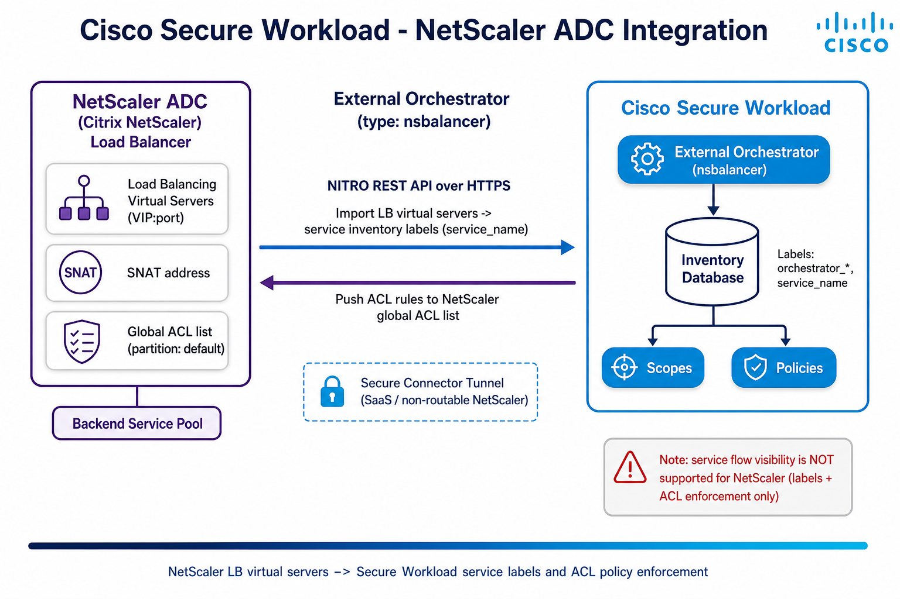

# Cisco Secure Workload → NetScaler ADC Integration Guide

A step-by-step, **beginner-friendly** integration guide for **NetScaler ADC** (formerly **Citrix NetScaler / Citrix ADC**) + **Cisco Secure Workload (CSW)** — covering **service-inventory labels** and **ACL policy enforcement** to the load balancer via the **NITRO REST API**.

> **⚠ Disclaimer:** This is a **community reference guide** prepared by Cisco Solutions Engineering — not an official Cisco product document. Always refer to the [official Cisco Secure Workload documentation](https://www.cisco.com/c/en/us/support/security/tetration/series.html) and the [Compatibility Matrix](https://www.cisco.com/c/m/en_us/products/security/secure-workload-compatibility-matrix.html) for authoritative, up-to-date guidance.

---

## What This Covers

| Area | Detail |
|---|---|
| **Integration paths** | **(1) External Orchestrator** (`type: Citrix Netscaler`, `orch_type: nsbalancer`) → labels + ACL enforcement · **(2) NetScaler Connector** (Citrix **AppFlow / IPFIX** on a Secure Workload Ingest appliance) → flow visibility |
| **Data imported** | Load Balancing **virtual servers** → service inventory labels (`service_name`); plus **stitched flow telemetry** via the connector |
| **Transport** | HTTPS **NITRO REST API** (orchestrator) · **AppFlow/IPFIX UDP 4739** (connector) |
| **Enforcement** | CSW translates policies → **NetScaler ACL rules** (global ACL list, partition default) — requires **write** creds |
| **Visibility** | ✅ **Flow visibility via the NetScaler Connector** (Citrix AppFlow/IPFIX, agentless, stitches client- and server-side NATed flows). ⚠ The **External Orchestrator itself does not** provide visibility for the detected virtual servers — that is what the connector is for. |
| **Connectivity** | Direct (on-prem) or via **Secure Connector** tunnel (SaaS / non-routable) |
| **Result** | `orchestrator_*` + `service_name` labels, ACL rule deployment |
| **Verified against** | CSW 4.x on-prem and SaaS; NetScaler ADC v12.0.57.19+ |

---

## Quick Start

### Prerequisites
- NetScaler ADC with reachable **NITRO REST API** (HTTPS/443)
- NetScaler service account — **read-only** for labels, **read+write** for ACL enforcement
- CSW 4.x with Site Admin / Root Scope Owner rights
- (SaaS only) a healthy **Secure Connector** tunnel
- Firewall: HTTPS (TCP/443) CSW → NetScaler NSIP / management endpoint

### Steps (summary)
1. `Manage → External Orchestrators → Create New Configuration`
2. **Type = Citrix Netscaler**; enter Name, Username, Password
3. **Hosts List** → NetScaler NSIP/mgmt IP, port `443` (use **another member** node for HA)
4. Leave **Enable Enforcement** off at first; check **Secure Connector Tunnel** for SaaS
5. **Create** (first snapshot ~60s)
6. Later, turn on **Enable Enforcement** + enforce a workspace policy (needs write creds → deploys ACLs)

### Verify
1. `Investigate → Inventory Search`
2. Run `orchestrator_system/orch_type = nsbalancer`
3. Use `orchestrator_*` / `service_name` labels to build **scopes** and **policies**

See the [full step-by-step guide](CSW-NetScaler-Integration-Guide.md) or [open the HTML version](CSW-NetScaler-Integration-Guide.html).

---

## Architecture Diagram

*Two independent paths. **External Orchestrator** (HTTPS NITRO REST): imports LB virtual servers as service labels and pushes ACL rules to the NetScaler global ACL list. **NetScaler Connector** (Citrix AppFlow/IPFIX on a Secure Workload Ingest appliance): ingests and stitches flow telemetry for visibility. Note: the orchestrator alone does not provide visibility for the detected virtual servers — the connector provides the flow data.*

---

## Video References

> **Legend:** 🎬 video · 📘 guide · 📄 doc

> There is currently **no dedicated CSW + NetScaler video**. The videos below cover the **same external-orchestrator + load-balancer enforcement pattern** (F5 BIG-IP) and general CSW concepts — useful analogs. See the guide's [§9](CSW-NetScaler-Integration-Guide.md#9-video-references).

| Video | Why it's relevant |
|---|---|
| [🎬 F5 BIG-IP IPFIX Configuration](https://www.youtube.com/watch?v=aJZEcZtUXDg) | Load-balancer + Secure Workload integration pattern |
| [🎬 Cisco Tetration & F5 BIG-IP AFM](https://www.youtube.com/watch?v=HcF3yQHmeXc) | ADC firewall/ACL enforcement concepts |
| [📘 CSW-User-Education library](https://github.com/chandrapati/CSW-User-Education) | Full curated CSW learning path |

---

## Files in This Repo

| File | Description |
|---|---|
| [`README.md`](README.md) | This file — quick start and overview |
| [`CSW-NetScaler-Integration-Guide.md`](CSW-NetScaler-Integration-Guide.md) | Full step-by-step guide (Markdown source) |
| [`CSW-NetScaler-Integration-Guide.html`](CSW-NetScaler-Integration-Guide.html) | Styled HTML — open in browser |
| [`csw-netscaler-architecture.png`](csw-netscaler-architecture.png) | Architecture diagram |
| [`build.sh`](build.sh) | Regenerate HTML/PDF from Markdown (requires pandoc + Chrome) |
| [`docs/CUSTOMER-HANDOFF.md`](docs/CUSTOMER-HANDOFF.md) | Checklist to hand to the customer's NetScaler / network team |

---

## Imported Labels — Quick Reference

| Key | Value |
|---|---|
| `orchestrator_system/orch_type` | `nsbalancer` |
| `orchestrator_system/workload_type` | `service` |
| `orchestrator_system/service_name` | *(virtual server name)* |
| `orchestrator_annotation/snat_address` | *(SNAT address)* |

> **Important:** Only **single-address** VIPs are imported (not address-pattern VIPs). Enabling enforcement makes **CSW the owner** of the NetScaler ACLs (deployed to the global ACL list / partition default); disabling it **removes** those ACLs. The **External Orchestrator does not** provide flow visibility for the detected virtual servers — deploy the separate **NetScaler Connector** (Citrix AppFlow/IPFIX) for flow telemetry.

---

## Step-by-Step Guides

> **Legend:** 🎬 video · 📘 guide · 📄 doc

Hands-on integration and deployment guides — follow these top to bottom to build out a deployment:

| Guide | Description | Best for |
|-------|-------------|---------|
| [📘 Agent Installation](https://github.com/chandrapati/CSW-Agent-Installation-Guide) | Deploy CSW agents on Linux / Windows / cloud | Day-1 sensor deployment |
| [📘 Policy Lifecycle](https://github.com/chandrapati/CSW-Policy-Lifecycle) | Policy discovery → enforcement workflow | Policy management |
| [📘 ISE / pxGrid](https://github.com/chandrapati/csw-ise-integration) | ISE/pxGrid: user-identity–aware microsegmentation | Identity & Zero Trust |
| [📘 AnyConnect NVM](https://github.com/chandrapati/csw-anyconnect-nvm) | Endpoint process flows + user identity via NVM | Endpoint telemetry |
| [📘 ServiceNow CMDB](https://github.com/chandrapati/csw-servicenow-integration) | ServiceNow CMDB label enrichment for workload scopes | CMDB-driven policy |
| [📘 Infoblox](https://github.com/chandrapati/csw-infoblox-integration) | Infoblox IPAM/DNS extensible-attribute label enrichment | IPAM/DNS-driven policy |
| [📘 F5 BIG-IP](https://github.com/chandrapati/csw-f5-integration) | F5 virtual-server labels, policy enforcement, IPFIX flow visibility | Load balancer segmentation |
| [📘 NetScaler ADC](https://github.com/chandrapati/csw-netscaler-integration) | NetScaler LB virtual-server labels, ACL enforcement + AppFlow/IPFIX flow visibility | Load balancer segmentation |
| [📘 AWS Connector](https://github.com/chandrapati/csw-aws-connector) | EC2 tag ingestion + VPC flow logs + Security Group enforcement | AWS workloads |
| [📘 Azure Connector](https://github.com/chandrapati/csw-azure-connector) | Azure VM tag ingestion + VNet flow logs + NSG enforcement | Azure workloads |
| [📘 GCP Connector](https://github.com/chandrapati/csw-gcp-connector) | GCE label ingestion + VPC flow logs + firewall enforcement | GCP workloads |
| [📘 NetFlow](https://github.com/chandrapati/csw-netflow-integration) | NetFlow v9/IPFIX agentless flow ingestion from switches | Network fabric visibility |
| [📘 ERSPAN](https://github.com/chandrapati/csw-erspan-integration) | Agentless packet mirroring for legacy / OT / IoT devices | Deep agentless visibility |
| [📘 Secure Firewall](https://github.com/chandrapati/CSW-Secure-Firewall-Integration-Guide) | NSEL flow ingestion from Cisco Secure Firewall (FTD/ASA) | Firewall flow visibility |
| [📘 Siwapp Lab App (vSphere)](https://github.com/chandrapati/siwapp-app-vsphere) | Terraform multi-tier demo app (PostgreSQL + HAProxy + Elixir) on any vCenter lab — a realistic east-west segmentation target | Lab / POV demo workloads |
| [📘 Splunk Integration](https://github.com/chandrapati/csw-splunk-integration) | CSW syslog alerts → Splunk SIEM | SecOps / SIEM teams |

## Resources

> **Legend:** 🎬 video · 📘 guide · 📄 doc

Learning paths, reference material, and day-2 tooling:

| Resource | Description | Best for |
|----------|-------------|---------|
| [📘 User Education](https://github.com/chandrapati/CSW-User-Education) | Onboarding guides, concept explainers, and curated video library | New CSW users |
| [📘 Compliance Mapping](https://github.com/chandrapati/CSW-Compliance-Mapping) | Map CSW controls to NIST, PCI-DSS, HIPAA, CIS | Compliance & audit |
| [📘 Tenant Insights](https://github.com/chandrapati/CSW-Tenant-Insights) | Tenant-level reporting and analytics | Visibility metrics |
| [📘 Operations Toolkit](https://github.com/chandrapati/CSW-Operations-Toolkit) | Day-2 ops scripts: health checks, reporting, policy analysis | Ongoing operations |
| [📄 Supported OS & Compatibility Matrix](https://www.cisco.com/c/m/en_us/products/security/secure-workload-compatibility-matrix.html) | Cisco's authoritative list of supported agent operating systems, external systems, and connector requirements | Platform planning & prerequisites |

> **Suggested customer journey:**
> User Education → Agent Installation → Policy Lifecycle → ISE/pxGrid → ServiceNow CMDB → Infoblox → F5 BIG-IP → NetScaler ADC → Splunk Integration → Compliance Mapping → Operations Toolkit
